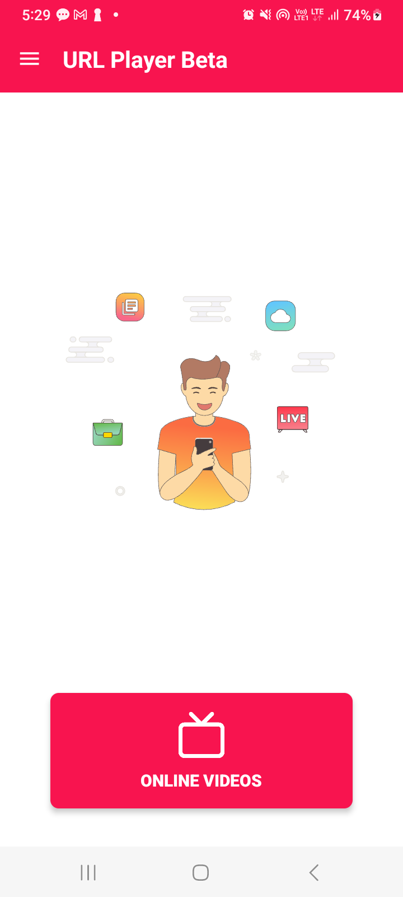
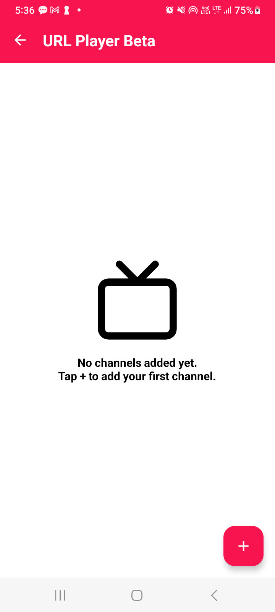
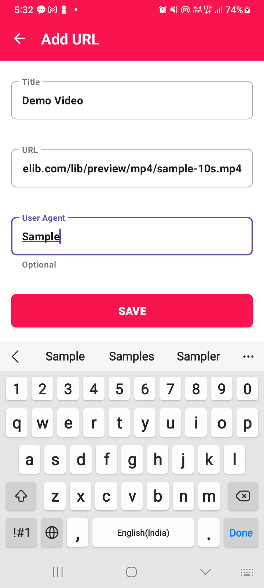
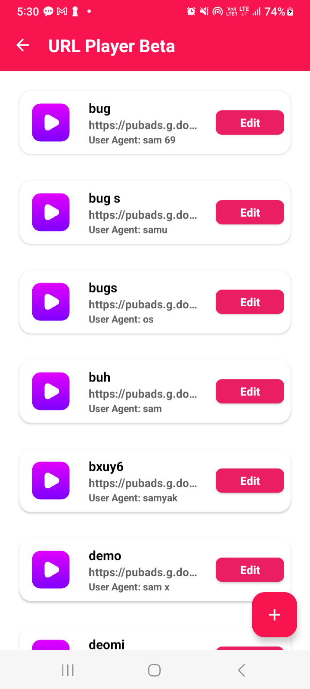
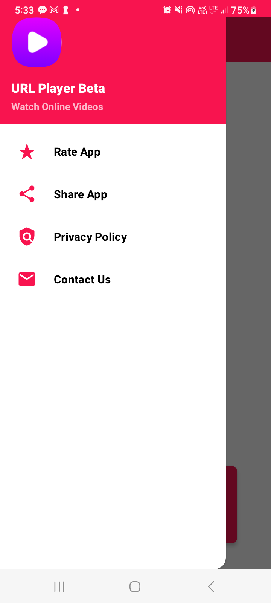

# URL Player Beta

<div align="center">  
    
  <h3>Your Ultimate URL Player Beta</h3>  
</div>  

URL Player Beta is an Android application that allows users to play online videos from various streaming sources. The app supports multiple video formats and streaming protocols.

## Features

- Play various video formats (HLS, MP4, AVI, MKV, etc.)
- Support for multiple streaming protocols (HTTP, RTMP, RTSP, etc.)
- Custom user agent support
- Save and manage video channels
- Material Design UI
- Navigation drawer with quick actions
- Dark theme support

## Supported Formats

### Video Extensions
- HLS (.m3u8)
- MP4 (.mp4)
- AVI (.avi)
- MKV (.mkv)
- M3U (.m3u)
- Transport Stream (.ts)
- QuickTime (.mov)
- WebM (.webm)

### Streaming Protocols
- HTTP/HTTPS
- RTMP
- RTSP
- UDP
- RTP
- MMS
- SRT

## 📸 Screenshots 


<table align="center" style="width:100%; text-align:center; border-collapse:collapse;">  
  <tr>  
    <td></td>  
  </tr>
</table>

<table align="center" style="width:100%; text-align:center; border-collapse:collapse;">  
  <tr>  
    <td></td>  
    <td></td>  
    <td></td>  
  </tr>  
  <tr>  
    <td></td>  
    <td></td>  
    <td></td>  
  </tr>  
  <tr>  
    <td></td>  
    <td></td>  
    <td></td>  
  </tr> 
</table>

## 📸 Screenshots Ads

<table align="center" style="width:100%; text-align:center; border-collapse:collapse;">  
  <tr>  
    <td></td>  
    <td></td>  
    <td></td>  
     <td></td>
  </tr>  
 
</table>


<table align="center" style="width:100%; text-align:center; border-collapse:collapse;">  
  <tr>   
  <video width="100%" autoplay loop muted src="https://github.com/user-attachments/assets/1b9fde47-9fb8-41ce-a3d9-b2b058b20417"   
  </tr>
</table>


## Installation

1. Download the latest APK from the [Releases](https://github.com/samyak2403/URLPlayer-Beta/releases/latest) section
2. Enable "Install from Unknown Sources" in your Android settings
3. Install the APK
4. Start enjoying your favorite videos!

## Building from Source

### Prerequisites
- Android Studio Arctic Fox or newer
- Android SDK 21 or higher
- Gradle 7.0 or higher

### Steps
1. Clone the repository:```sh https://github.com/samyak2403/URLPlayer-Beta.git ```

2. Open the project in Android Studio

3. Sync Gradle and build the project

4. Run on your device or emulator

## Libraries Used

- ExoPlayer - For video playback
- Material Design Components
- AndroidX Libraries
- Lottie - For animations
- ViewBinding - For view binding

## Contributing

1. Fork the repository
2. Create your feature branch (`git checkout -b feature/AmazingFeature`)
3. Commit your changes (`git commit -m 'Add some AmazingFeature'`)
4. Push to the branch (`git push origin feature/AmazingFeature`)
5. Open a Pull Request

## License

This project is licensed under the MIT License - see the [LICENSE](LICENSE) file for details

## Contact

 - [@samyak](mailto:arrowwouldpro@gmail.com)

Project Link: [https://github.com/yourusername/URLPlayerBeta](https://github.com/samyak2403/URLPlayerBeta)

## Acknowledgments

- [ExoPlayer](https://github.com/google/ExoPlayer)
- [Material Design](https://material.io/design)
- [Android Jetpack](https://developer.android.com/jetpack)
